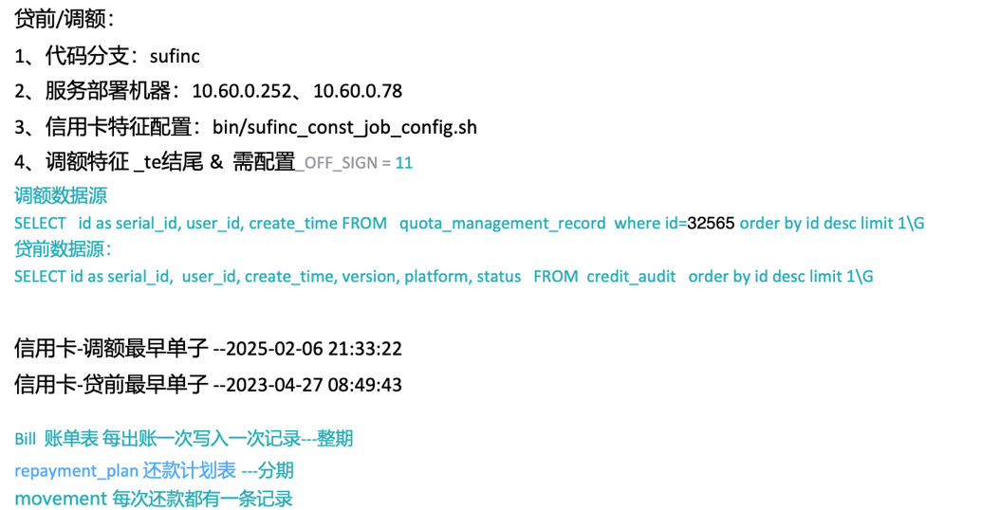

[//]: # (1、订单授信表) virtual_loan

[//]: # (2、放款表) loan --整期
[//]: # (3、还款表) repayment_plan --分期

贷前/调额：
1、代码分支：sufinc
2、服务部署机器：10.60.0.252、10.60.0.78
3、信用卡特征配置：bin/sufinc_const_job_config.sh
4、调额特征 _te结尾 &  需配置_OFF_SIGN = 11
调额数据源
SELECT   id as serial_id, user_id, create_time FROM   quota_management_record  where id=32565 order by id desc limit 1\G
贷前数据源：
SELECT id as serial_id,  user_id, create_time, version, platform, status   FROM  credit_audit   order by id desc limit 1\G

信用卡-调额最早单子 --2025-02-06 21:33:22   
信用卡-贷前最早单子 --2023-04-27 08:49:43  

Bill  账单表 每出账一次写入一次记录---整期
repayment_plan 还款计划表 ---分期
movement 每次还款都有一条记录
