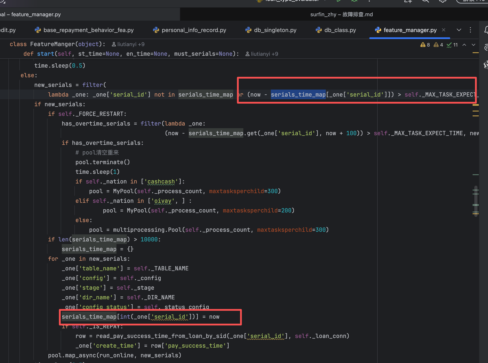

[//]: # (select from_unixtime&#40;update_time&#41;,serial_id,tab_name,from_unixtime&#40;time&#41; as '本地时间', from_unixtime&#40;time + 50400&#41; as '北京时间', &#40;update_time-time&#41; from feature_compute_stat where &#40;update_time-time&#41; > 10 and tab_name !="model_result" and tab_name !="te_model_result" order by id desc limit 50;)

[//]: # (短信：select content, create_time from message_info_record where user_id = 5601114 and create_time <= &#40;1767039461 + 30&#41; and create_time >0 order by id asc; )

模型上线

[//]: # (    验证研发单子后需回复需求方： 测试通过，可以上线)
    select * from model_result where serial_id=4230918\G
    
    select * from feature_task where serial_id=4230918;
    报错停止任务：
    select * from feature_compute_stat where  stage in ("KabyBXGBoost377Dpd7Cre1", "KabyBXGBoost378Dpd7Cre2") and serial_id in ();
    
    update feature_compute_stat set status=1 ,update_time=1757667395 where id=938722958;

1. 风控特征计算超时【4385279 stage model 超过60s 】
    select *,update_time -time  from feature_compute_stat  where serial_id=6131448 and stage="model" and (update_time -time) >60 ;
    select *,update_time - time from feature_compute_stat where serial_id=4933865 and stage="credit" and (update_time - time) > 30 ;
    select *,update_time - time from feature_compute_stat where serial_id=4911187 and stage="model_check" and (update_time - time) > 60 ;
    
    select *,update_time - time from feature_task where serial_id=4911187 and stage="model_check" and (update_time - time) > 60 ;

2. 模型分缺失
    
    2.1 模型分缺失看下是否打任务
    select * from feature_task where serial_id in  (4421553) and stage ="kabyblightgbm370dpd7cre3_6";
    2.2 查看线下/线上是否存在模型分
    select kabyblightgbm370dpd7cre3_6 from model_result where serial_id in (4421553);

3. 检查app数据源
    select * from app_install_upgrade_time_record where  user_id = 250890 and code=7100 and status=6 and create_time <=1723960551 and create_time >=(1723960551-365*86400);
4. goofin 特征超时
   4.1 检查阻塞特征任务
       select * from feature_compute_stat where status=0;
   4.2 找一个特征查看报错任务
       less logs/erros
       less log.
   4.3 检查是否专线出了问题[分别在kaby和goofin上测试网络]
          telnet mxmodelx.inner.zhenrongbao.com 80 
   4.4 
    goofin telnet模型系统不通，联系运维富哥 和越哥，确认是否专线问题，富哥反馈ipsec 连接断开，把 ipsec 隧道重置后连接恢复。特征正常
   5. 模型分回溯
       batch.py     1. select * from batch_score where model_id=385  and token="jillannnile7-71a0-nana-a93f-nimk5c7gx380" order by serial_id  asc limit 1;
                    2. select * from batch_score where model_id=385 and token="jillannnile7-71a0-nana-a93f-nimk5c7gx380" order by serial_id  desc limit 1;
                        1和2查看的是已经完成的最早单子和最晚单子
                    3.查看单子时间： select *,from_unixtime(create_time)  from virtual_loan where serial_id=4501975 \G

                    4.查看需要回溯单子数量：select count(*) from virtual_loan where loan_type=1 and create_time between 1751299216 and 1764187246;
                    5.查看已经回溯完成的模型分数量：select count(*)  from batch_score where model_id=343 and token="jillannnile7-71a0-nana-a93f-nimk5c7gx300";
                    若4和5数量一致，则模型分回溯正常 ，所以只需要重新回溯没有回溯的时间段就行了
       sync_model_data.py同步模型机器分数到特征线下库 """select * from batch_score where model_id='%s' and token = '%s' and score != '-8888888';""" % (model_id, tocken)

6. select *,from_unixtime(create_time)  from virtual_loan where serial_id=3276800 \G
   7. sufinc多头特征数据库一直重连，卡住问题
select serial_id,tab_name,from_unixtime(update_time),from_unixtime(time) as '本地时间', from_unixtime(time + 50400) as '北京时间', (update_time-time) from feature_compute_stat where (update_time-time) > 10 and tab_name !="model_result" and tab_name !="te_model_result" order by id desc limit 50;       mysql> select *,update_time -time  from feature_compute_stat  where serial_id=289425  and stage="model" and (update_time -time) >60 ;
   +----------+-----------+--------------------------+--------+-------+------------+---------+-------------+-------------------+
   | id       | serial_id | tab_name                 | status | stage | time       | task_id | update_time | update_time -time |
   +----------+-----------+--------------------------+--------+-------+------------+---------+-------------+-------------------+
   | 25223384 |    289425 | phone_apply_behavior_fea |      1 | model | 1767905356 | 6162609 |  1767906294 |               938 |
   8. 卡住日志
2026-01-08 14:49:16 feature_manager.py[line:64] INFO start_compute serial_id:289425
2026-01-08 14:49:16 phone_apply_behavior_fea.py[line:262] INFO serial_id:289425 , user_id:234609 kaby_user_ids:(5222609), goofin_user_ids:(6124431)
2026-01-08 15:04:49 db_class.py[line:122] INFO 执行sql语句错误:(2013, 'Lost connection to MySQL server during query'),实例:47.87.10.62, 数据库:mx_loan, sql:
                    SELECT 
                      serial_id, create_time 
                    FROM 
                      virtual_loan 
                    WHERE 
                      user_id in (6124431)
                      AND create_time < 1767901926
                    ORDER BY 
                      create_time ;
   9. 同一个订单重复计算
   grep "end_compute serial_id:289425" log.phone_apply_behavior_fea_on.20260108.*
log.phone_apply_behavior_fea_on.20260108.14:2026-01-08 15:04:51 feature_manager.py[line:70] INFO end_compute serial_id:289425   935232.969046ms
log.phone_apply_behavior_fea_on.20260108.15:2026-01-08 15:04:52 feature_manager.py[line:70] INFO end_compute serial_id:289425   161.139965057ms
log.phone_apply_behavior_fea_on.20260108.15:2026-01-08 15:04:52 feature_manager.py[line:70] INFO end_compute serial_id:289425   145.963907242ms
log.phone_apply_behavior_fea_on.20260108.15:2026-01-08 15:04:53 feature_manager.py[line:70] INFO end_compute serial_id:289425   148.781061172ms
log.phone_apply_behavior_fea_on.20260108.15:2026-01-08 15:04:53 feature_manager.py[line:70] INFO end_compute serial_id:289425   144.814014435ms
log.phone_apply_behavior_fea_on.20260108.15:2026-01-08 15:04:53 feature_manager.py[line:70] INFO end_compute serial_id:289425   145.168066025ms
log.phone_apply_behavior_fea_on.20260108.15:2026-01-08 15:04:54 feature_manager.py[line:70] INFO end_compute serial_id:289425   148.355007172ms
log.phone_apply_behavior_fea_on.20260108.15:2026-01-08 15:04:54 feature_manager.py[line:70] INFO end_compute serial_id:289425   145.623922348ms
    feature_manage.py分发任务时未计算完的订单不在serials_time_map里面或者 初次处理任务的时间> _MAX_TASK_EXPECT_TIME = 120的也会被加入待计算任务中   这个订单卡了15分钟 所以多打了7个任务进来
   dig rr-4hf9v5t95x7t7a2wc.mysql.mexico.rds.aliyuncs.com
   dig命令是 DNS 诊断和调试的核心工具，通过该命令可以快速获取域名的 DNS 解析信息，帮助定位网络连接或配置问题。

10. 17号线上卡单 
    select from_unixtime(time) st ,stage,tab_name, update_time -time ht  from feature_compute_stat where serial_id=4937246 ;
    
    短信类计算慢 sqllite锁  获取缓存5s超时 
    2026-01-17 10:10:27 feature_manager.py[line:65] INFO start_compute serial_id:4937241
    2026-01-17 10:10:42 local_kv_cache.py[line:76] WARNING LocalKvCache: _do_get: database is locked
    2026-01-17 10:10:42 msg_base_features.py[line:326] INFO Cache log: 4937241 getting cache done, using 5004.68087196(ms)
    2026-01-17 10:10:42 msg_base_features.py[line:336] INFO Cache log: 4937241 missed, direct getting 164 rows, using 3.36313247681(ms)
    2026-01-17 10:10:47 local_kv_cache.py[line:63] WARNING LocalKvCache: _do_save: database is locked
    2026-01-17 10:10:47 db_common.py[line:111] INFO delete_record   table_name:mx_message_bank_agency_v1_1_keyword_filter_fea       serial_id:4937241
    2026-01-17 10:10:47 db_common.py[line:90] INFO write_record     table_name:mx_message_bank_agency_v1_1_keyword_filter_fea       fields_value:{'user_id': 7471631, 'serial_id': 493724
    1}
    2026-01-17 10:10:47 db_common.py[line:544] INFO update_feature_compute_sta      serial_id:4937241       table_name:mx_message_bank_agency_v1_1_keyword_filter_fea       stage:model
    2026-01-17 10:10:47 feature_manager.py[line:71] INFO end_compute serial_id:4937241      20147.108078ms

    
    sqllite3缓存  local_kv_cache 锁
    
    后面模型也请求超时
    查日志： /home/work/project/logs
		less log.app
		搜索 KabyAApplyXGBoost105Gap24Hour 
		搜索 模型KabyAApplyXGBoost105Gap24Hour执行失败

      app/web/service/modelService.py
      app/models/utils/predict_new2_util.py          